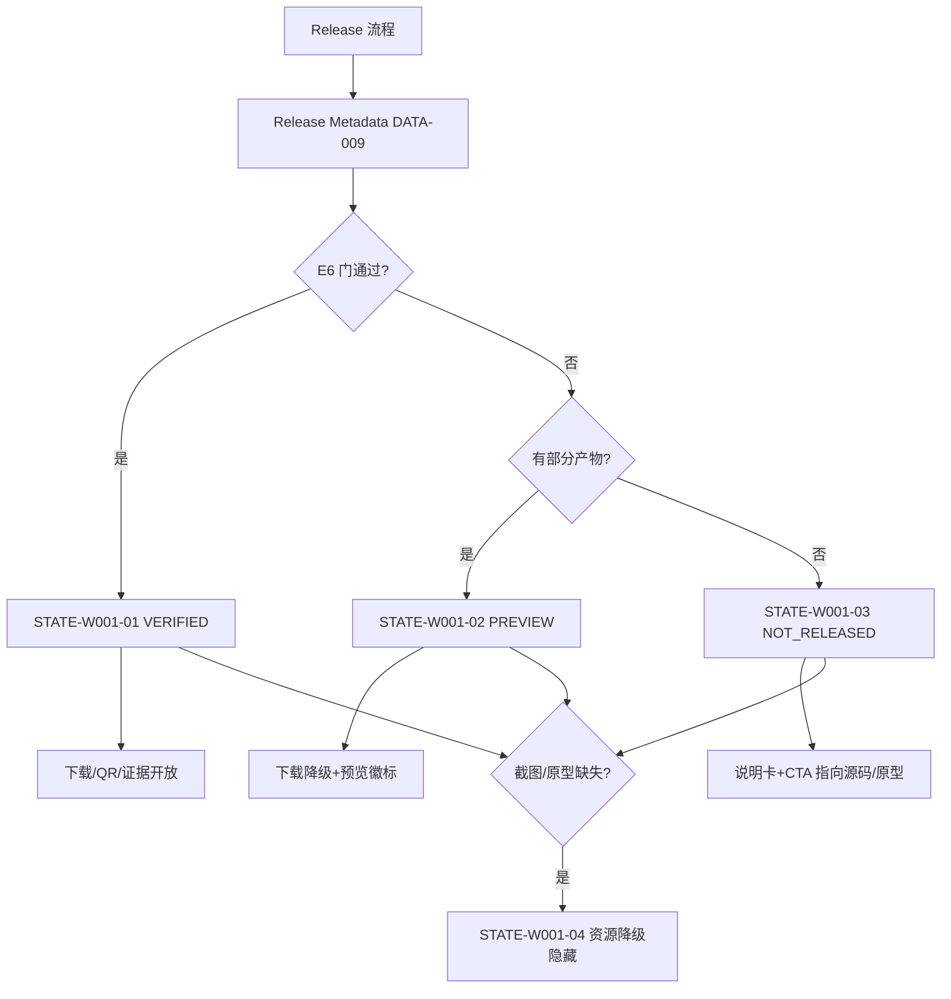

# WEB-001 公开落地页目标规范

## 0. 文档元数据

```yaml
status: REVIEW
document_version: 1.0
owner: Smart BLE Product / Web
last_reviewed: 2026-09-01
approved_by: null
supersedes: []
```

## 1. 页面目标与存在必要性

公开可信入口：10 秒讲清产品定位（UniApp Android App + 微信小程序的开源 BLE 工具），用证据（版本、commit、SHA、设备、截图、Observer 流）支撑每个声明，用真实下载/二维码或诚实的 NOT_RELEASED 完成转化，并承载 ESP32 双模式与三条快速开始。

存在必要性：产品对外的唯一权威门面；发布状态与证据体系（`18`）的公开展示面。

## 2. 用户角色与使用场景

- PER-05 路人：10 秒信任判断（5-1）、下载前验证（5-2）、夜间手机浏览（5-3）。
- PER-04 贡献者：快速开始入口（4-1）。
- PER-01/02：把落地页当说明书入口分享。

## 3. 进入来源、路由参数、深链与冷启动

- 路由：`/`（文档站首页）；锚点：`#download`、`#evidence`、`#quickstart`、`#esp32`、`#smart-hid`、`#platforms`。
- 来源：搜索引擎、GitHub README、App 关于页官网入口、分享。
- 深链/冷启动：锚点在无 JS 时仍可定位（服务端渲染纯 HTML 段落 id）。

## 4. 信息架构与区块顺序（自上而下）

1. 顶部导航：Smart BLE / 快速开始 / 平台状态 / ESP32 / 文档 / GitHub；
2. Hero：一句话定位 + 主 CTA（体验：微信小程序码或在线原型）+ 次 CTA（GitHub 源码）+ 当前版本与状态徽标（来自 Release Metadata）；
3. 核心 BLE 闭环图：发现设备 → 检查广播 → 连接 → GATT 读写/Notify → 日志 → 广播/OTA → ESP32 验证；
4. 能力卡矩阵：每卡（扫描、广播解析、连接、GATT、多设备、日志、手机广播+Observer、OTA、Smart HID、Profile 扩展）带状态徽标与详情链接；
5. 平台状态表（`08` 投影）；
6. 真实 App 截图组（带 alt；缺失时隐藏并注明）；
7. 在线交互原型入口（10 页 HTML 原型；缺失时隐藏）；
8. ESP32 区：fixture_peripheral 与 fixture_observer 双卡（接线、一键构建、固件下载+SHA、Observer 串口输出示例 JSON）；
9. 快速开始三条：微信 5 分钟 / Android 5 分钟 / ESP32 5 分钟（步骤可复制）；
10. 下载区（#download）：Android APK 卡（版本/commit/SHA256/设备清单/证据链接）、微信小程序码卡、固件卡；无产物时对应卡 NOT_RELEASED；
11. 证据与已知限制区（#evidence）：最新 Release 的 commit、App/小程序/固件版本、通过平台、证据入口（EVID 链接）、已知限制清单；
12. Smart HID 区（#smart-hid）：能力边界（配网/诊断，不含控制链路）与状态；
13. 开源与贡献区：GitHub/Issue/Security/License(MIT)/贡献指南；
14. 页脚：版权、License、隐私、站点地图。

## 5. 首屏必须可见内容

Hero 定位、主/次 CTA、版本+状态徽标、核心闭环图起点、导航。禁止在首屏出现无证据数字（如"6+ 入口"）。

## 6. 字段定义与数据来源

| 字段 | 来源 | 规则 |
|---|---|---|
| 版本/commit/SHA/产物 URL | DATA-009 Release Metadata | 构建期注入，禁止手写 |
| 状态徽标 | `18` 公开状态 | 五词 |
| 截图/原型可用性 | 构建产物清单 | 缺失→降级隐藏 |
| 已知限制 | DATA-009 | 每次 Release 必更 |
| 证据链接 | EVID-001..008 索引 | 仅指向存在的证据 |

## 7. 完整操作表

| Operation ID | 控件/入口 | 显示条件 | 禁用条件 | 用户输入 | 调用链 | 成功反馈 | 失败反馈 | 跳转/返回 | 清理 | 测试 |
|---|---|---|---|---|---|---|---|---|---|---|
| OP-W001-01 | 主 CTA（体验） | 小程序码可用或原型存在 | 均缺失时改为 GitHub CTA | 无 | 锚点/打开原型 | 到达目标 | — | #quickstart/原型 | 无 | TEST-R-006/009 |
| OP-W001-02 | 次 CTA（GitHub） | 恒显 | 无 | 无 | 外链 | 打开仓库 | 404→ERR-WEB-01 检查 | 外部 | 无 | TEST-R-005 |
| OP-W001-03 | 下载 Android APK | APK 产物+SHA 存在 | 无产物→NOT_RELEASED 卡（无链接） | 无 | 产物 URL | 下载开始 | 404/SHA 不符→ERR-WEB-01/02 | 外部 | 无 | TEST-R-001/008 |
| OP-W001-04 | 微信小程序码 | 正式码已发布且扫码验证通过 | 未发布→NOT_RELEASED | 扫码 | 码图 | 进入小程序 | 失效→ERR-WEB-03 | 外部 | 无 | TEST-R-009 |
| OP-W001-05 | 固件下载 | 固件产物+SHA | 无→NOT_RELEASED | 无 | 产物 URL | 下载 | 同 OP-03 | 外部 | 无 | TEST-R-008 |
| OP-W001-06 | 查看证据 | 证据区 | 证据存在 | 无 | EVID 链接 | 打开证据 | 404→ERR-WEB-01 | 外部/站内 | 无 | TEST-R-007 |
| OP-W001-07 | 查看已知限制 | 恒显 | 无 | 无 | #evidence 锚点 | 定位 | — | 锚点 | 无 | TEST-R-006 |
| OP-W001-08 | 导航锚点 | 恒显 | 无 | 无 | 平滑滚动 | 定位 | — | 锚点 | 无 | TEST-R-006 |
| OP-W001-09 | 快速开始三选一 | 恒显 | 无 | 无 | 到达对应教程 | 打开 | 404→ERR-WEB-01 | 站内 | 无 | TEST-R-005 |
| OP-W001-10 | Smart HID 区链接 | 区块展示 | 无 | 无 | 详情/教程 | 打开 | 同上 | 站内 | 无 | TEST-R-005/007 |

## 8. 完整状态表

| State ID | 状态名称 | 进入条件 | 页面内容 | 允许操作 | 退出条件 | 数据更新 | 测试 |
|---|---|---|---|---|---|---|---|
| STATE-W001-01 | VERIFIED 发布态 | Release Metadata 完整且 E6 门通过 | 下载/码/证据全开 | 全部 | 新 Release | 全字段联动 | TEST-R-001..010 |
| STATE-W001-02 | PREVIEW 证据前态 | 产物未齐/E5 未全 | 下载区降级、能力卡 PREVIEW 徽标、Hero 显"预览" | OP-01/02/06..10 | 达 E6 | 徽标更新 | TEST-R-003/007 |
| STATE-W001-03 | NOT_RELEASED 无产物 | 无任何公开产物 | 下载区为说明卡（无链接）；CTA 指向原型/源码 | OP-01/02/06..10 | 产物发布 | — | TEST-R-003 |
| STATE-W001-04 | 资源缺失降级 | 截图/原型缺失 | 对应区隐藏+一行说明 | 其余 | 资源补齐 | — | TEST-R-006 |

## 9. 错误、空态和恢复动作

ERR-WEB-01 链接/下载 404（自动检查+修复；公开前阻断）；ERR-WEB-02 SHA 不符（阻断发布）；ERR-WEB-03 二维码失效（重新生成）；ERR-WEB-04 Metadata 漂移（与 `18` 比对失败阻断）。空态=STATE-W001-03/04（诚实降级，不留死区）。

## 10. 页面跳转与返回规则

站内锚点+文档站路由；外链新标签。无返回栈问题。

## 11. Runtime / Web 调用链

```text
Release 流程 → release manifest（DATA-009）
→ 构建期注入（VitePress 数据加载）
→ 静态渲染页面（无 JS 可读核心内容）
→ 部署（GitHub Pages / 现有站点）
```

## 12. 资源所有权与生命周期

静态页无运行时资源（N/A：SSG 页面）；数据所有权归 Release Metadata 生成流程。

## 13. 平台差异与降级

mobile/desktop 响应式；dark/light 跟随系统+切换；键盘可完成全部锚点导航；无 JS 时 Hero/闭环/平台表/快速开始文本可读（下载需 JS 的部分给出直接 URL 文本）。

## 14. ESP32 / Smart HID / Release 依赖

ESP32 双模式卡（TEST-E-008 复现）；Smart HID 状态随 DEC-006；Release Metadata 是全部状态字段唯一来源（`18`）。

## 15. 安全、隐私和脱敏

无 Cookie/追踪（或仅匿名统计且声明）；截图脱敏（SEC-006）；外链 rel 规范；下载供应链见 SEC-012。

## 16. 性能、容量和超时

LCP ≤2.5s；图片懒加载+压缩；页面总重 ≤2MB（NFR-018）。

## 17. 无障碍、文案和视觉规则

对比度 ≥4.5:1（暗色同样）；全部图片 alt；键盘焦点顺序=视觉顺序；二维码有文字等效（小程序名可搜索）；文案与 `17` 一致；SEO：title/og/canonical 与 `01` 定位一致，禁用"大一统"旧词。

## 18. 自动化测试映射

TEST-R-001..010（声明/下载/QR/链接/SHA/Metadata/SEO/a11y/降级）。

## 19. 真机 / 发布测试映射

E6 清单（TEST-R-001..010）+ 发布后烟测（FLOW-014、TP-G6）。无 E5 组件（页面本身），但其声明引用 E5 证据。

## 20. 公开声明与证据要求

CLAIM-001..030 全表见 `18` 第 6 节；每个 CLAIM 绑定 TEST-R 用例与证据 EVID；无证据声明一律不得出现。发布阻断规则见 `01` 第 8 节。

## 21. 验收条件

- [x] 14 区块齐备且顺序固定；
- [x] 所有状态字段来自 Release Metadata（无手写数字）；
- [x] 无产物即 NOT_RELEASED（无假链接）；
- [x] 三条快速开始 ≤2 次点击可达；
- [x] SEO/OG/canonical 与产品定位一致；
- [x] 移动/桌面/暗色/键盘/alt 全达标。

## 22. 非目标与禁止行为

- 不宣传多端大一统、不把 Flutter/Tauri 列为产品入口（REFERENCE 不进能力卡）；
- 不出现不可用下载按钮、假二维码、无证据数字；
- 不展示内部审计细节与敏感数据；
- 不做账号/订阅/营销弹窗。

## 23. Mermaid 流程图 / 状态图



## 24. 关联 ID 与链接

REQ-058~061｜FEAT-069~076｜FLOW-013/014｜ERR-WEB-01..04｜DATA-009｜CLAIM-001..030｜[`18 版本与发布`](../18_VERSION_RELEASE_METADATA_AND_PUBLIC_STATUS.md)｜[`08 平台矩阵`](../08_PLATFORM_CAPABILITY_AND_DEGRADATION_MATRIX.md)
