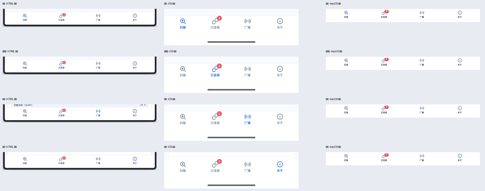
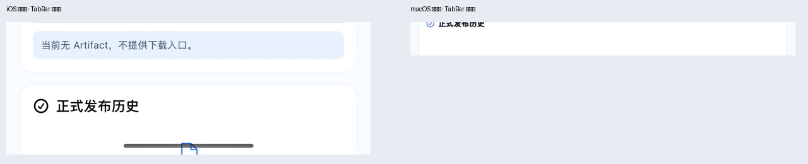

# Apple native TabBar alignment audit

```yaml
date: 2026-09-10
scope: HTML canonical TabBar vs SwiftUI iOS and AppKit macOS
result: PASS_WITH_OS_SAFE_AREA_DIFFERENCE
```

## Contract

The implementation now consumes the four icon paths from the canonical HTML sprite instead of substitute platform icons:

- height: 64
- padding: 4 top / 8 horizontal / 16 bottom
- icon: 23 × 23
- label: 10, medium inactive / bold active
- connected badge: minimum 16 × 16, danger tone, top-right of the connected icon
- active color: canonical primary; inactive color: canonical muted

## Steps and health

| Step | Check | Health | Evidence |
|---|---|---|---|
| 1 | Scan selected | PASS | `comparison/tabbar-states.jpg` |
| 2 | Connected selected + count badge | PASS | `comparison/tabbar-states.jpg` |
| 3 | Broadcast selected | PASS | `comparison/tabbar-states.jpg` |
| 4 | About selected | PASS | `comparison/tabbar-states.jpg` |
| 5 | User taps through all four iOS tabs | PASS | `TabBarUITests.testFourTabsSwitchWithoutConnectionStateHijackingSelection` |
| 6 | Connection-state updates do not hijack the selected tab | PASS | same UI test and removal of the automatic tab redirect |
| 7 | Secondary page hides TabBar and consumes the released space | PASS | `comparison/secondary-hidden.jpg`, iOS UI test, macOS PageSmoke UIS-11 |
| 8 | Accessibility labels and selected values | PASS_STRUCTURE | iOS buttons expose label/count/selected value; macOS buttons expose explicit accessibility labels. |

## Visible result





## Platform difference

iOS retains the system home-indicator safe area below the 64-point product TabBar. macOS has no home indicator and uses the product bar directly against the window content edge. This is an OS-owned difference; icon geometry, spacing, type, state color, and badge placement remain shared.

## Verification limits

Screenshots and XCTest confirm layout, state switching, hit targets, and visibility. They do not by themselves prove VoiceOver rotor order or macOS full-keyboard focus order; those remain in the accessibility gate.

## Automated verification

- iOS SwiftPM unit tests: 12/12 PASS.
- iOS Xcode unit + TabBar UI scheme: PASS; dedicated TabBar UI tests 2/2.
- macOS CoreUnit: 62/62 PASS.
- macOS PageSmoke: 17/17 PASS, including `UIS-11 tabHidden=true`.
- Shared Swift Smart HID vectors: 9/9 PASS.
