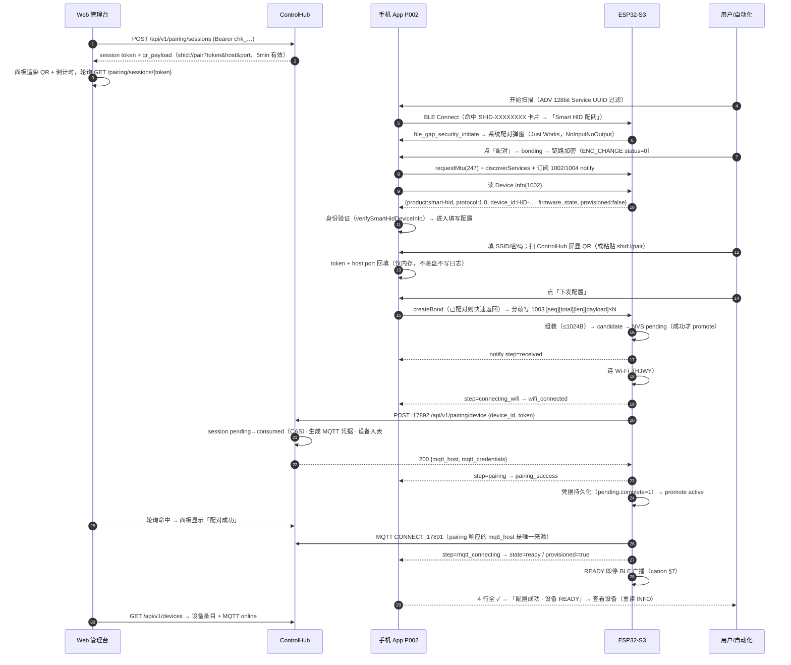
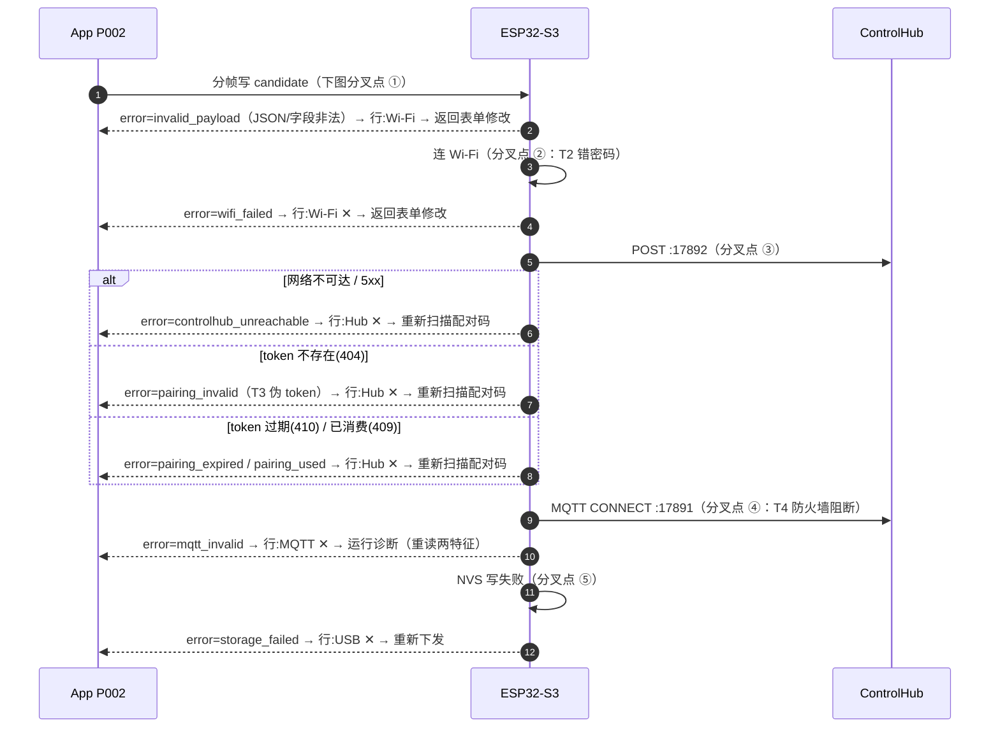
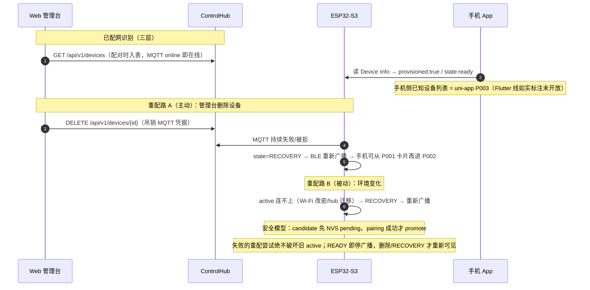
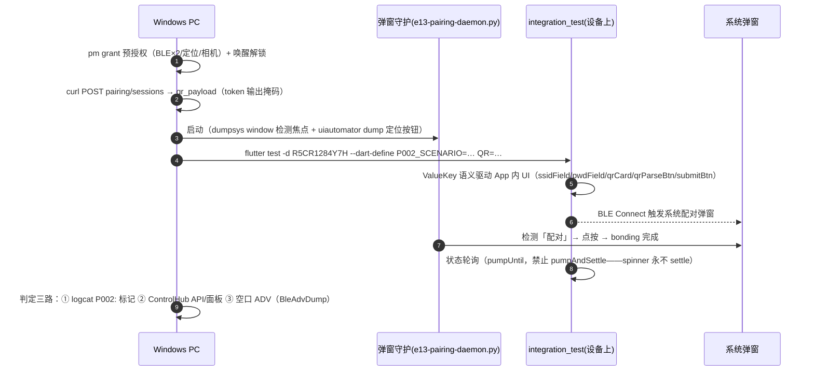

# E13 · P002 Smart HID 配网三方时序（真机/真网络/真 ControlHub）

> 事实源：`smart-hid-workspace/protocols/ble/PROVISIONING_V1.md`（canon）+
> `smart-hid-firmware/components/ble_provision/ble_provision.c`（GATT/SMP 行为）+
> `smart-hid-controlhub/docs/openapi.yaml`（HTTP 契约）。
> 本文是执行 T1–T7 前的三方配合基线，描述已逐条与上述源码核对。

## 图 A · 主成功链路（T1）

参与方：WEB=ControlHub Web 管理台（Windows 192.168.21.77 浏览器）、
APP=手机 BLE Toolkit+（P002 向导）、DEV=ESP32-S3 真固件、HUB=ControlHub 服务
（HTTP :17890 / 配对 :17892 / 内嵌 MQTT :17891）。

## 图 B · 错误路径分叉（T2/T3/T4/T5）

全部沿图 A 同一条主干，按**分叉点**区分；App 侧行失败映射与恢复按钮
（`provisionErrorRow` / `provisionRecoveryAction`，与 canon §6 错误表逐条对齐）：

App 侧独立于设备的两条失败路径（不经 DEV/HUB）：

- **timeout**：submit 后 60s 未见到终态（含「取消等待」主动触发）→ 行:MQTT ✕ → 重新下发。
- **connection_lost**：GATT 断开回调（T5：esptool 复位芯片注入）→
  填写页出现「已断开」横幅 + 重新连接；下发页报 `connection_lost` → 重新连接设备。

## 图 C · 已配网识别与重配（T6/T7）

## 图 D · E13 自动化驱动架构（本文档的执行方式）

uiautomator 对「Samsung + Flutter」组合无语义树（冻结），像素驱动已放弃；
系统弹窗（配对/权限）uiautomator **可见**。因此采用两层分工：

场景注入手段（全部真实生效，非模拟）：

| 注入 | 手段 | 场景 |
|---|---|---|
| 错密码 | dart-define 传入错误密码 | T2 |
| 伪 token | dart-define 传入 32hex 伪造串（Hub 404） | T3 |
| MQTT 阻断 | Windows 防火墙入站阻断 TCP 17891（需管理员，失败则 BLOCKED） | T4 |
| 设备断连 | `esptool --port COM13 run` 复位芯片（logcat 标记联动） | T5 |
| token 失效 | 等待 5min 过期或先消费一次 | 备用 |

## 据此推导的执行顺序（关键：READY 即停广播）

T1 成功会让设备停广播、后续场景扫不到设备，因此**失败类场景在前、成功链路在后**：

U-01 离开确认（一次性凭据）→ T2 错密码 → T3 伪 token → T4 MQTT 阻断+诊断 →
T5 取消等待+断连注入 → **T1 成功**（真 Wi-Fi+真 pairing+真 MQTT）→ T6 设备表核验 →
T7 删除设备 → RECOVERY 重新广播（空口）→ 再配成功 → Xiaomi 快乐路径（再删再配）→ 复原。
